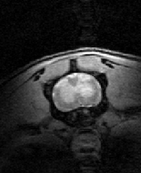

# mice_uqueensland_gm



Segmentation model for mouse spinal gray matter segmentation. Created with [ivadomed](http://ivadomed.org/) using data from University of Queensland 🇦🇺.

Additional context: https://forum.spinalcordmri.org/t/segmetation-centerline-errors/352

This model is readily available in [SCT](https://spinalcordtoolbox.com/en/stable/) (v5.0.0 and higher) and can be used as follows:
```bash
sct_deepseg -i NIFTI_IMAGE -task seg_mice_gm
```

Any question? Please feel free to post on [SCT forum](https://forum.spinalcordmri.org/c/sct/8). 
